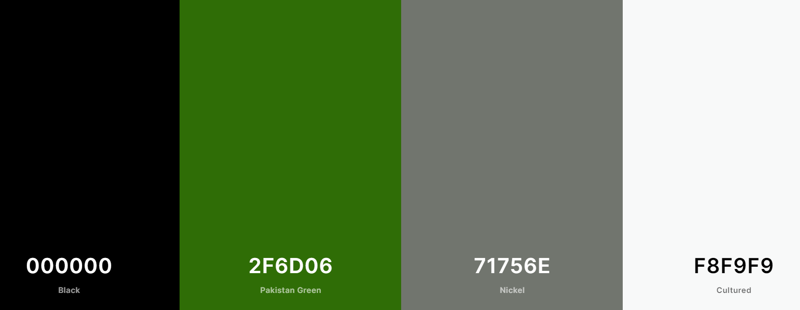

### **Dandu Stores**

Dandu Stores is the online platform of Dandu Supermarket, a platform where customers can shop and buy their daily groceries and other household needs material online. The platform is designed to be user friendly, simple, informative (products &Orders) and Intuitive, built with focus on prospective user satisfaction. 
Dandu Stores was designed by Bethel Ayodele as Final Milestone Project at Code Institute Full-stack Web Development Diploma Course.

## **UX**

### **User Goals**

*	To give visitors to website clear and concise information about products
*	To give users easy access to register and become users
*	To give users friendly and easy browsing experience, diverse product search and eventual  checkout.
*	To give users opportunity to select products of their choices and secure payment checkout.
*	To give users ease of browsing when they return to their profile with information about their previous orders.

### **Business Goals**

*	To offer customers the same if not better experience as being in the store physically thereby making prospective client happy and satisfied.
*	To offer the business potential growth capabilities by removing the limitation of place, time, distance, and queue through seamless and contactless online transactions.
*	To build users trust by providing a platform where their payment dealings are safe, secure and data privacy is optimal.
*	To build a platform where marketing whole be activated through user’s profile data.
*	Expand business potential for the stores with online store as a means of publicity.

### User Stories

#### Persona
Emma is a 40-year-old nurse working in a public health hospital in Stockholm, she wishes to shop groceries for her household but worries about going into a store to avoid the potential of being infected with coronavirus because daily she cares for old and age citizens who being infected with the virus could be potentially deadly. A colleague tells her about Dandu Stores, and she visit the website.

*	Emma visits the store online and discovers she can have same experience as going to the store physically online.
*	Emma can search for products in different categories with ease and simplicity.
*	She registers to have a profile; select the products she wants to buy and add them to her cart.
*	She checkout and pays securely with stripe payments.

John is Registered customer with Dandu Stores, who made some order online at Dandu Stores, on delivery he discovers that a pack of air-freshener he ordered online arrived broken, he takes a picture and goes online:

*	John goes online, login into his profile and clicks on Return product.
*	 He fills the form and send the report to the store with the fault report.
*	He posts the product back to the store for a replacement or refund.

### **Color Design Choice**

* Geneva
* Lato

#### **Colour**

#### **Wireframes**

#### Wireframe: Desktop

#### Wireframe: Tablet

#### Wireframe: Mobile

## **Features**

#### Existing Features

* Navbar: All the pages have a functional navbar, brand name and links to access products with relevant information. All the different sections e.g profile, checkout have functional navigation links.

* Product Page: All products are displayed appropriately with clear pictures and product information, price, their country of origin and manufacturing company. Detail product information are provided with suggestions to how the products can be used or consumed in some cases and notifying customers if products are available.

* Authentication: Safe and easy register form page and user profile after registration. All necessary information like email, phone number, address is required for each user profile. Users are then allowed to have a username and create a password of their choice for access when they return to their profile.

* Search Engine: A functional search to sort and filter product through name, price, category or even words or description for quick and easy access to products instead of having to go through each product. These will be particularly helpful in situations of having thousands of products and searching each product will be laborious.

* Shopping Cart: Customers can add products to the cart with images, information of the product and number of products added on clear display. Thus, helping customer to easily avoid putting unwanted products or avoid mistakes with numbers of product. A secured checkout button is available for customers to click to take them to checkout payment.

* Checkout Page: After adding products to their cart, customers can securely checkout with necessary information for delivery of their product and this information can be auto saved to avoid filling the form every order placement except they choose to do so. The checkout has been integrated with Stripe payment API for safe and secure payment experience with a success message on each payment sent to the customer.

* Return Product Page: Users are allowed to return faulty and/or damaged products shipped to them. They can simply do this by filling out a return product form and explaining what the fault is with the product before shipping back the product.

* Feedback/Complaints Page: Users are allow to give both positive and negative feedbacks through a form with their details, with a subject and details information form to be able to get realtime response from customers which is important for growth. 

* User Profile: A profile page with all the necessary information detail form required by new users to fill and auto saved for user on return to their profile. The profile information can be update, edited in situations where needed.

* Footer: A footer with the logo of the store and access to easily go back to necessary sections from the footer. Contact information and social media links.

## Information **Architecture**

### Product Model: All products have a unique identity number, a name and product description to give customers an understanding of the product and the country the product are sourced from. The price for each product, clear and descriptive image and information about if the product is in stock or not when selecting product.

### Product Return Model: To comply with customer satisfaction and right to return a damage product, a product return model was created. Registered customers can log in to their profile page and select to return a product. The product information; id number and name will be filled, the customer details and detailed information about what is the fault or damaged with the product.

### Feedback/Complaint Model: To be successful as a business it is important to get both criticism and good feedback from customers in order to improve as a company. Therefore all registered customers can leave a feedback and/or complain about a product or service with their email, a subject and details about their complaints/feedback. The store would be able to use this informations to reply appropriately.

## **Technology Used**

### **Tools**

*	Balsamaic used for wireframe design.
*	Adobe Photoshop used for image resize and compression.
*	Git for version control
*	GitHub used to store and share project code remotely.
*	Heroku for hosting of the website.
*	Coolors.co for color palette generation.
*	Stripe payment infrastructure used to validate and accept card payments securely.
*	Django python web framework for fast development and professional design.

### **Libraries**
*	Bootstrap To simplify the responsiveness and the structure of the website.
*	Google Fonts for font styling.
*	jQuery To simplify DOM manipulation.
*	Font Awasome To incorporate icons.
*	Jinja Framework Used for template execution and code re-usability.

### **Programming Languages**
*	HTML
*	CSS
*	Javascript
*	Python

### **Database**
*	PostgreSQL
*	Sqlite
*	AWS S3

## **Test**

The website has been tested through every app, and functions as intended. All the links functions as wanted; authentication is also functional. Manual testing was also carried out, any visitor to the website should have the following experiences through testing:

*	I arrive at the landing page through browsing the url to the website.
*	All the products were accessed and displayed when I clicked the shop Now button.
*	I was able to use the filters and sort to get products on the search.
*	I searched for products using prices, categories and words and got the desired results.
*	I clicked on product and individual product image was properly displayed, information of product and price was also visible.
*	I was able to add product to the cart by clicking on add button, increase and reduce product quantity with the (+/-) button, and got message to confirm add success
*	I selected more products to be sure the add product works properly and clicked on secured checkout which to me to the checkout page successfully.
*	I filled my information on the checkout form and used the stripe test card to check successful order payment.
*	I went to event in my Stripe and confirm the successful status of my intent through the webhook.
*	I checked to get a confirmation email for the successful payment.
*	I clicked on the link for the profile page to see that order history with all the necessary details are available.
*	I clicked on the return product form and filled the necessary details, submitted, and got a success confirmation.
*	I used the cancel order form to cancel, and it functioned properly.
*	The Stripe Test card used are: 4242 4242 4242 4242 07/26 789----without authentication
And 5555 5555 5555 4444 04/27 567 with authentication.

The following code online validator and beautifier tools were use:
*	Freeformatter: For Html codes arrangement and formatting.
*	ExtendsClass: To validate and beautify python codes
*	BeautyTools: To validate and beautify JavaScripts codes.

## **Deployment**

Dandu Stores is deployed on Heroku and the following steps were taken during deployment;
*	Sign up on Heroku and create app to host the project code
*	Create a free plan of PosgreSQL database
*	Install dj-database-url and psycho2-binary
*	Setup the setting of the database on settings.py
*	Install all necessary plugins and freeze requirements.txt to ensure heroku runs properly
*	Ensure all sensitive key are save in .env or env.py and also ensure they are saved on environment variable in Heroku. See requirements.txt
*	Connect Heroku to repository on Heroku for automatic deployment.
*	Create AWS account and open S3, create group user and generate policy
*	Create S3 bucket to hold all the static and image files.
*	Connect S3 to repository and Heroku with AWS keys.
*	Commit and push from your repository, and confirm your images and static are loadrd on AWS.
*	To run on gitpod ensure all the plugin listed on requirements.txt is installed and DEVELOP equals True
*	Ensure all fixtures are loaded with 'python3 manage.py loaddata '
*	Ensure all models are migrated when created and also after any chenges are made on them.

### **Limitations**

*	Chat functionality will be very useful to attend to the needs on customers in real time but featured yet on the website.
*	Reviews for product will help customers and store to know products that are interesting and performing well but not yet implemented.
*	Password recovery is not yet implemented.

### **Credits**

### **Media**

All the images used in this project including the landing page were source from IcaSverige AB and WillisSverige AB.

### **Acknowledgement**

Dandu Stores inspired and modelled after Boutique Ado Project from Code Institute, Othere Ideas and functionalities were also inspired from IcaSverige AB web platfrom and the following videos were very instrumental:

* https://www.youtube.com/watch?v=UpssHYl6bjA

* https://www.youtube.com/watch?v=VOddmV4Xl1g

* https://www.youtube.com/watch?v=NB6WFVDt7Sg

### Special Thanks
Special thanks to my mentor Dick Vaandlaren for his immense guidance, help and support through this programmea lways going out of his way to mentor me patiently. A big thank you to Code Institute studentcare for always helping out even in difficult situations and big shout out to the tutors especially Fatima.

### **For Contact**
tayo4ayo@gmail.com

